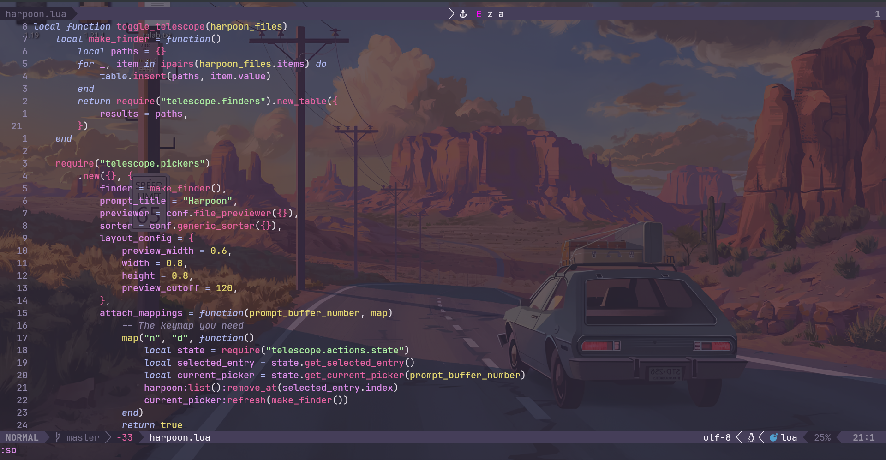

# My Neovim Configuration

## Overview
[Brief description of your Neovim setup, philosophy, and key features]

## Plugin Management
### Plugin Manager
[lazy.nvim]

## Custom Keymappings
| Keybinding | Function | Mode |
|-----------|----------|------|
| `<leader>ff` | Find files | Normal |
| `jk` | Exit insert mode | Insert |

## Screenshot

## Themes and Appearance
- Color Scheme: hardhacker
- Font: fira code
- Statusline/tabline: lualine

## Future Improvements
- [ ] Add more language servers
- [ ] Add more custom snippets
- [ ] highlight lsp definitions
