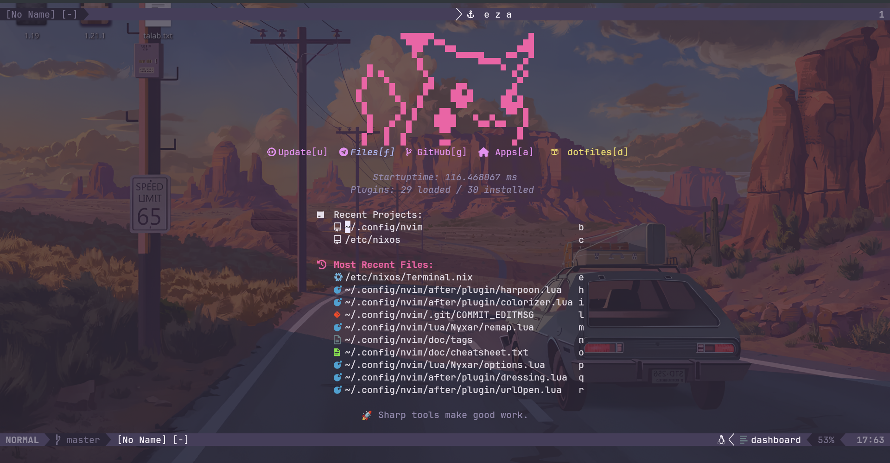

# My Neovim Configuration

## Overview
[Brief description of your Neovim setup, philosophy, and key features]


## Plugin Management
### Plugin Manager
[lazy.nvim]


## Custom Keymappings
| Keybinding | Function | Mode |
|-----------|----------|------|
| `<leader>ff` | Find files | Normal |
| `jk` | Exit insert mode | Insert |

## Screenshot


## Installation Steps
1. Clone the repository
2. Install dependencies
3. Open Neovim and run `:PlugInstall`

## Custom Functions
```lua
-- Example custom function
function MyCustomFunction()
    -- Your custom logic here
end
```

## Themes and Appearance
- Color Scheme: 
- Font: 
- Statusline: 

## Performance Optimizations
[List any specific performance tweaks]

## Troubleshooting
[Common issues and their solutions]

## Future Improvements
- [ ] Add more language servers
- [ ] Improve startup time
- [ ] Add more custom snippets
